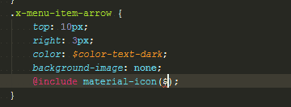

# MaterialDesignIcons-SCSS-Variables
This SCSS part file allows you to use [MaterialDesignIcons](https://github.com/Templarian/MaterialDesign)
project directly from your SCSS files: instead of using `<i class="mdi mdi-refresh"></i>`, you'll be able to style any
element from SCSS:



## How to use this

```scss
// Refresh icon
.icon-refresh {
    @include material-icon($mdi-refresh);
}
```

### Using bower
1. Add bower dependency

        bower install materialdesignicons-scss-variables

2. Reference SCSS part files using relative path
    
    ```scss
    /* style.scss */ 
    
    // Import materialdesignicons mixin & variables
    @import '../../../bower_components/materialdesignicons-scss-variables/dist/materialdesignicons';
    @import '../../../bower_components/materialdesignicons-scss-variables/dist/materialdesignicons-vars';
    ```

### Manually
1. Copy [`dist/_materialdesignicons.scss`](https://raw.githubusercontent.com/chteuchteu/MaterialDesignIcons-SCSS-Variables/master/dist/_materialdesignicons.scss)
    & [`dist/_materialdesignicons-vars.scss`](https://raw.githubusercontent.com/chteuchteu/MaterialDesignIcons-SCSS-Variables/master/dist/_materialdesignicons-vars.scss)
    into your project

2. Reference SCSS part files 

    ```scss
    /* style.scss */ 
    
    // Import materialdesignicons mixin & variables
    @import 'materialdesignicons';
    @import 'materialdesignicons-vars';
    ```

## How to update `_materialdesignicons-vars.scss` file

> Note: you usually don't want to do that, except if some icons are missing from the generated file.

The `generate.py` script generates `_materialdesignicons-vars.scss` from MaterialDesignIcons input file:

```scss
$mdi-access-point: "\F002";
$mdi-access-point-network: "\F003";
$mdi-account: "\F004";
$mdi-account-alert: "\F005";
$mdi-account-box: "\F006";
$mdi-account-box-outline: "\F007";
$mdi-account-card-details: "\F5D2";
$mdi-account-check: "\F008";
...
```

1. Run `python generate.py`: [_variables.scss](https://raw.githubusercontent.com/Templarian/MaterialDesign-Webfont/master/scss/_variables.scss)
will be downloaded and parsed from MaterialDesignIcon's repository to update `_materialdesignicons-vars.scss`.
2. Enjoy `dist/_materialdesignicons-vars.scss`!
3. Open in issue if bower's package is outdated
