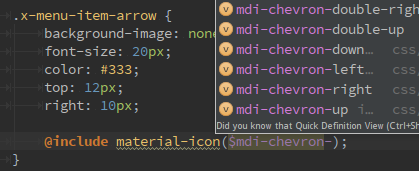

# MaterialDesignIcons-SCSS-Variables
This SCSS part file allows you to use [MaterialDesignIcons](https://github.com/Templarian/MaterialDesign)
project directly from your SCSS files: instead of using `<i class="mdi mdi-refresh"></i>`, you'll be able to style any
element from SCSS:

## How to use this
Copy [`generated/_materialdesignicons.scss`](https://raw.githubusercontent.com/chteuchteu/MaterialDesignIcons-SCSS-Variables/master/generated/_materialdesignicons.scss)
& [`generated/_materialdesignicons-vars.scss`](https://raw.githubusercontent.com/chteuchteu/MaterialDesignIcons-SCSS-Variables/master/generated/_materialdesignicons-vars.scss)
into your project, and import them in your scss file:

    # style.scss 
    
    # Import materialdesignicons mixin & variables
    @import 'materialdesignicons';
    @import 'materialdesignicons-vars';
    
    // Refresh icon
    .icon-refresh {
        @include material-icon($mdi-refresh);
    }

## How to update `_materialdesignicons-vars.scss` file

> Note: you usually don't want to do that, except if some icons are missing from the generated file.

The `generate.py` script generates `_materialdesignicons-vars.scss` from MaterialDesignIcons input file:

    $mdi-access-point: "\F002";
    $mdi-access-point-network: "\F003";
    $mdi-account: "\F004";
    $mdi-account-alert: "\F005";
    $mdi-account-box: "\F006";
    $mdi-account-box-outline: "\F007";
    $mdi-account-card-details: "\F5D2";
    $mdi-account-check: "\F008";
    ...

1. Run `python generate.py`: [_variables.scss](https://raw.githubusercontent.com/Templarian/MaterialDesign-Webfont/master/scss/_variables.scss)
will be downloaded and parsed from MaterialDesignIcon's repository to update `_materialdesignicons-vars.scss`.
2. Enjoy `generated/_materialdesignicons-vars.scss`!
